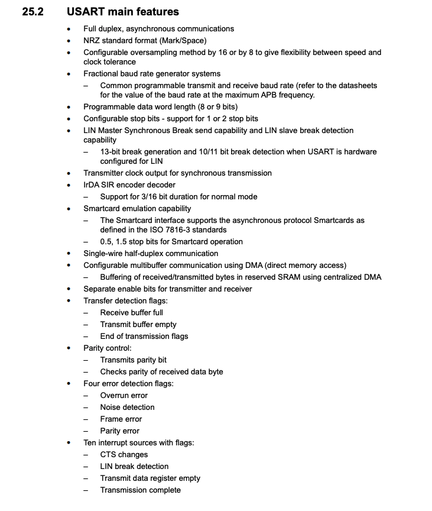

#### Intro
I was working on an RTOS-related project, and as you may know working without logging is not easy.
i needed to print some events for debugging purposes, which led me to set up USART. so why now put it
as separate project, so what is USART at the first place?

###### USART
stands for universal synchronous asynchronous receiver transmitter, and it's peripheral that can
help us communicate with other peripherals, let's be more specific in my stm32f446re 

it's pretty powerful but we don't need it for this simple task I'm going to use serial protocol 
(UART), and with this configuration 8 for data width and 1 bit for the stop bit something that 
looks like this

#### GPOI WITH USART configuration