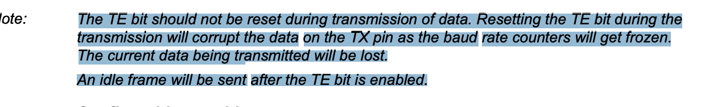

#### Intro
I was working on an RTOS-related project, and as you may know working without logging is not easy.
i needed to print some events for debugging purposes, which led me to set up USART. so why now put it
as separate project, so what is USART at the first place?

## DISCLAIMER
i'm not explaining every bit here, this will help yes but only if already a bit familiar with
this kind of workflow, and this is for stm32f446re

###### USART
stands for universal synchronous asynchronous receiver transmitter, and it's peripheral that can
help us communicate with other peripherals, let's be more specific in my stm32f446re 


it's pretty powerful but we don't need it for this simple task I'm going to use serial protocol 
(UART), and with this configuration 8 for data width and 1 bit for the stop bit something that 
looks like this


#### GPOI WITH USART configuration
first let's take a look at GPIO and see what configuration it should be in which pin and so on,
is it just normal output

##### GPIO PORT Info


are we going to use normal output? well I don't yet, the next diagram has the answer


so it's not normal output somehow we need to tell that I/O use that line (Alternate function output) and here's the configuration of the I/Os


so now I should set the right I/O pin to alternate function mode, how would I do that? and to 
which pin? and keep in mind that a PC supports USB not uart, so we need some conversion, but 
there's one built in, so now I need also to know which USART peripheral to work with so now
we should answer these questions ?

1. how would I set I/O to alternate function? 
2. to which PIN (I/O)?
3. which USART should be chosen ?
4. and how to configure this USART peripheral more on this later let's figure out the connection first


with this info from 'user manual' a lot of questions have been answered

2. PORTA PIN 2
3. USART2

but still questions 1 and 4 are still unanswered

so with this info somehow USART tx line should be connected to PIN2 of PORTA

5. how would I do that? no idea,

first let's see how to set alternate function look down


this is one way is to write directly to these locations, but let's libopencm3 API for GPIO


with a bit of digging we see this but i see the mode analog and so on but i don't see alternate
function


but after seeing this macro it must be the right function


```c
void gpio_setup(void)
{
  rcc_periph_clock_enable(RCC_GPIOA); // for every peripheral
  
  gpio_mode_setup(GPIOA,
  
  GPIO_MODE_AF, // this where we set the pin to alternate function
  
  GPIO_PUPD_PULLUP, GPIO2);
}
```

that's good we now configured the I/O for alternate function, but still I/O have no idea that
it should be USART2 peripheral and why choose pin PA2 and not PA3 both of them are connected to
USART after all, well look down


okay now still some questions to be answered
1. how to link them (PA2 with USART2_TX)?
2. how to configure USART2?

let's see the first one, since we still configuring GPIO, while reading section of GPIOs
i see


and here's what I image now


there's mux that I need to play so that USART2_TX is connected PIN2, so what value should be 
in that register AFRL and where to put,


keep in mind that my goal now is to find what value should I put in AFRL and where


where is down, now what value should be there AF0 OR AF1 ..., let's look at datasheet


good it should AF7, let's look at libopencm3 again


```c
void gpio_setup(void)
{
  rcc_periph_clock_enable(RCC_GPIOA);
  
  gpio_mode_setup(GPIOA, GPIO_MODE_AF, GPIO_PUPD_PULLUP, GPIO2);
  gpio_set_af(GPIOA, GPIO_AF7, GPIO2);
}
```

okay we are done with GPIO, let's look at USART peripheral, here's what I want
send 8 bits no parity bit, 1 stop bit that's all since USART peripheral is bit complicated,
I'm not gonna go into details of it, keep in mind that I'm doing this because I want to log some
data in other project that have so no optimization, okay let's see


you see I forget to talk about the baud rate since I'm going to be asynchronous i.e no clock wire
both devices need to agree on the sampling rate, and I'm going to use 115200 it's used a lot
what I want up to this point

- 8 bit data width
- no parity
- 1 stop bit
- 115200 baud rate


while reading I see this


what it means I'm not really sure but, I think that there's some config needed to say that either
i want to transmit or not something like *setting "usart mode"* keep it in mind also


you see there's some mode stuff going on


here's the register responsible for setting the baud rate


i don't want the first one *synchronous mode* but the second one I don't understand

while reading this [resource](https://www.silabs.com/documents/public/application-notes/an0059.0-uart-flow-control.pdf)


which is not the case now, so I don't want *synchronous nor hardware control flow*


it's not clear yet, but i think that by default even if the clock is enabled for the peripheral
USART is not generating internal pulses to drive transmitter and receiver, and it should be 
enabled some how, and it does make sense I don't want USART to be working while I'm doing 
configuration setting the width and so on, so let's add this to the mix now, we need
- 8 bit data width
- no parity
- 1 stop bit
- 115200 baud rate
- enable peripheral?? maybe



I'm sure now that there's some bit that needs to be enabled, with this overview let's head to 
libopencm3 and see, here's what I need again no advanced mode stuff no flow control, 1 stop bit
8 bit data width 115200 baud rate let's see if we can find what we need there

here's some info that may help


this is the only default that I saw while reading, okay let's get back to libopencm3 API


i believe that's all I need let's check

```c
void usart_setup(void)
{
  rcc_periph_clock_enable(RCC_USART2);

  usart_set_flow_control(USART2, USART_FLOWCONTROL_NONE);
  usart_set_databits(USART2, 8);
  usart_set_baudrate(USART2, 115200);
  usart_set_parity(USART2, 0);
  usart_set_stopbits(USART2, 1);

  usart_set_mode(USART2, USART_MODE_TX);
  usart_enable(USART2);
}
```

I don't want any flow control mode so let's just put it to USART_FLOWCONTROL_NONE
let's add some helper functions and do some testes

```c
void uart_write_byte(uint8_t data)
{
  if (data == '\n')
    usart_send_blocking(USART2, '\r');
  usart_send_blocking(USART2, (uint16_t)data);
}

void uart_write(const uint8_t *data, uint32_t length)
{
  for (uint32_t i = 0; i < length; ++i)
    uart_write_byte(data[i]);
}
```

#### Result


and it's working